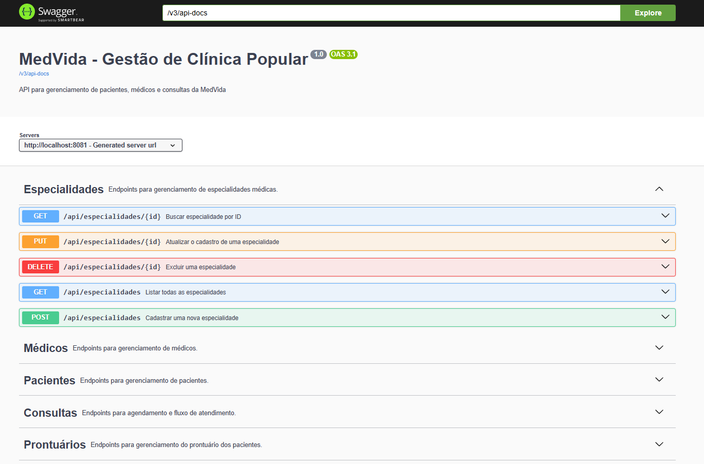

# 🏥 API MedVida - Clínica Popular

Bem-vindo ao repositório do projeto **MedVida**, uma API desenvolvida para o gerenciamento inteligente de uma clínica popular. Este projeto visa facilitar o controle de médicos, pacientes, especialidades, consultas e prontuários médicos.

---

## 👤 Aluno

**Bernardo da Silva Araújo de Oliveira** *Projeto Individual - Residência SERRATEC*

---

## 📝 Descrição do Projeto

O sistema **MedVida** é uma API RESTful projetada para centralizar as operações administrativas e clínicas de uma unidade de saúde popular. O objetivo é permitir que a clínica mantenha um cadastro organizado, possibilitando o agendamento de consultas e o histórico clínico dos pacientes de forma eficiente e segura.

---

## 🚀 Tecnologias Utilizadas

Este projeto foi construído utilizando o ecossistema Spring:

* **Java 21**
* **Spring Boot 3.4.3**
* **Banco de Dados:** PostgreSQL
* **Spring Data JPA (Hibernate)**
* **Bean Validation (Jakarta)**
* **Documentação:** SpringDoc OpenAPI (Swagger 2.8.5)
* **Gerenciador de Dependências:** Maven
* **Ambiente de Desenvolvimento:** VS Code

---

## ⚙️ Configuração do Ambiente

### 1. Banco de Dados (PostgreSQL)
Certifique-se de ter o PostgreSQL instalado. Crie um banco de dados vazio chamado `medvida_db` e configure as credenciais no arquivo `src/main/resources/application.properties`:

```properties
spring.datasource.url=jdbc:postgresql://localhost:5432/medvida_db
spring.datasource.username=seu_usuario
spring.datasource.password=sua_senha
```
---

## 2. Acesso à Documentação (Swagger)
O projeto utiliza caminhos customizados definidos no application.properties:

* Interface Visual (Swagger): `http://localhost:8081/swagger-ui.html`
* Documentação JSON: `http://localhost:8081/api/v3/api-docs`

## 🚀 Como Executar

### Pré-requisitos

* Java JDK 21 ou superior instalado.
* Maven instalado.
* Uma IDE (IntelliJ, Eclipse ou VS Code).
* Banco de dados PostgreSQL configurado.

---
### Passos para rodar

1. **Clone o repositório:**
```bash
git clone https://github.com/lcamaraol/medvida-api.git
```


2. **Acesse a pasta do projeto:**
```bash
cd medvida-api
```


3. **Execute a aplicação no terminal:**
```bash
mvn spring-boot:run
```


4. A aplicação estará disponível em 
```bash
http://localhost:8081
```
---

### 🔗 Documentação dos Endpoints

> **Atenção:** Todos os endpoints seguem o prefixo `/api/...`

<details>
<summary><b>1. Pacientes (`/api/pacientes`)</b></summary>

* **POST:** Cadastra um novo paciente.
```json
{
  "nome": "Nome do Paciente",
  "cpf": "12345678901",
  "email": "email@teste.com"
}
```


* **GET:** Lista todos os pacientes cadastrados.
* **GET /{id}:** Busca um paciente específico pelo ID.
* **DELETE /{id}:** Remove um paciente do sistema.
</details>

<details>
<summary><b>2. Médicos (`/api/medicos`)</b></summary>

* **POST:** Cadastra um médico.
```json
{
  "nome": "Dr. House",
  "crm": "12345",
  "especialidadesIds": [1, 2]
}
```

* **GET:** Lista todos os médicos.
* **GET /{id}:** Busca um médico específico pelo ID.
* **DELETE /{id}:** Remove um médico do sistema.
</details>

<details>
<summary><b>3. Especialidades (`/api/especialidades`)</b></summary>

* **POST:** Cadastra uma nova especialidade.
```json
{
  "nome": "Cardiologia"
}
```

* **GET:** Lista todas as especialidades.
* **GET /{id}:** Busca detalhes de uma especialidade.
* **DELETE /{id}:** Remove uma especialidade.
</details>

<details>
<summary><b>4. Consultas (`/api/consultas`)</b></summary>

> **Nota:** Formato de data obrigatório: `HH:mm - dd/MM/yyyy`

* **POST:** Agenda uma consulta.
```json
{
  "pacienteId": 1,
  "medicoId": 1,
  "dataHora": "14:30 - 22/05/2026",
  "descricao": "Consulta de rotina"
}
```
* **GET:** Lista todas as consultas.
* **GET /{id}:** Busca uma consulta pelo ID.
* **DELETE /{id}:** Cancela/Remove uma consulta.
</details>

<details>
<summary><b>5. Prontuários (`/api/prontuarios`)</b></summary>

* **POST:** Cria um novo prontuário.
```json
{
  "pacienteId": 1,
  "descricao": "Histórico de asma"
}
```

* **GET:** Lista todos os prontuários.
* **GET /{id}:** Busca prontuário pelo ID.
* **DELETE /{id}:** Remove um registro de prontuário (ID é do Prontuário!).
</details>

## 💡 Observações Relevantes

* **Dados Iniciais:** O projeto conta com um `DataInitializer` (CommandLineRunner) que popula automaticamente o banco de dados com médicos, pacientes e especialidades ao iniciar a aplicação. Assim, você não precisa cadastrar nada manualmente para testar!
* **Arquitetura:** O projeto segue o padrão de camadas (Controller, Service, Repository, DTO, Entity), garantindo a separação de responsabilidades e facilidade de manutenção.
* **Tratamento de Exceções:** Implementação de tratamento global de erros para fornecer mensagens claras em casos como `ResourceNotFound` ou entrada de dados duplicados.
* **Gerenciamento do Banco:** O parâmetro `spring.jpa.hibernate.ddl-auto=update` mantém o esquema do banco de dados atualizado automaticamente.

---

### 🖼️ Exemplo de Visualização no Swagger

